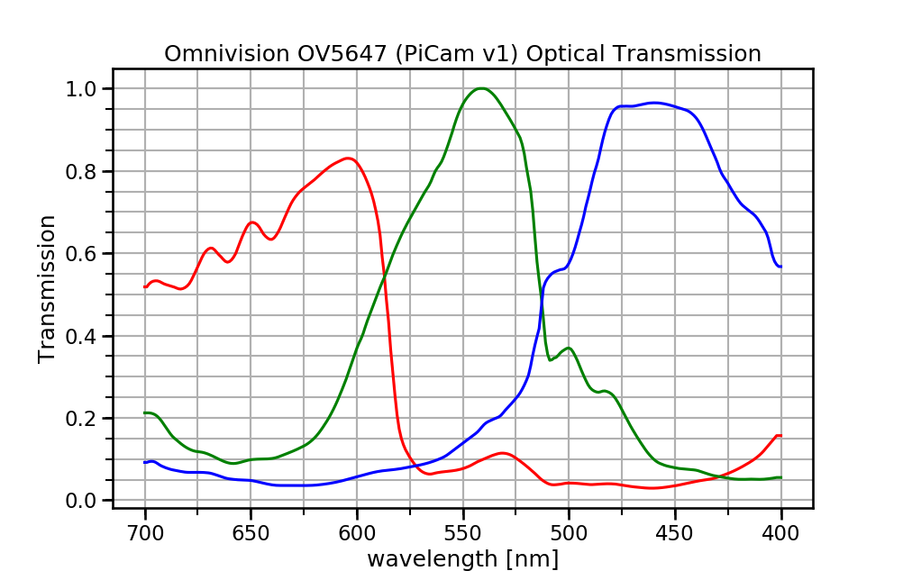
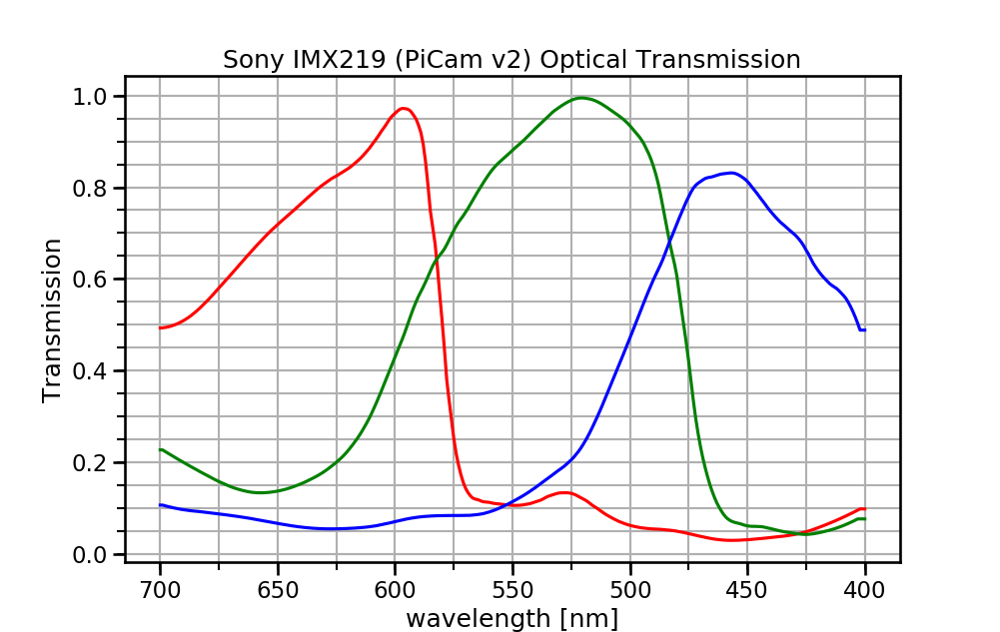

# Raspberry Pi camera spectral response

Raspberry Pi camera spectral response, for the v1 Omnivision chip and v2 Sony chip.
Considers QE of sensor and Bayer mask transmission in cascade. 
Traces digitized by Koen Hufkens.

## References

* [OV5647 Datasheet](http://www.khufkens.com/wp-content/uploads/2015/11/006_paper_rhodes_omnivision_bsi2.pdf)
* [Digitized data traces](http://www.khufkens.com/ov5647-spectral-response/)
